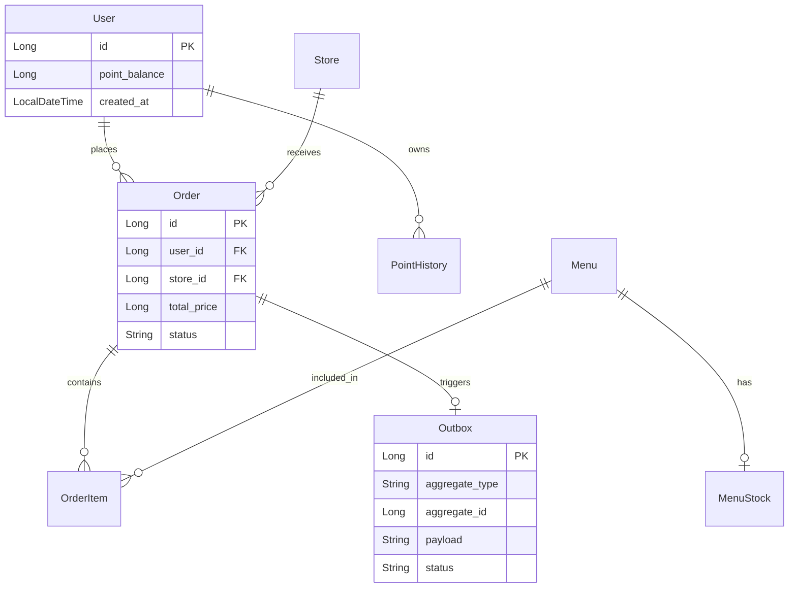
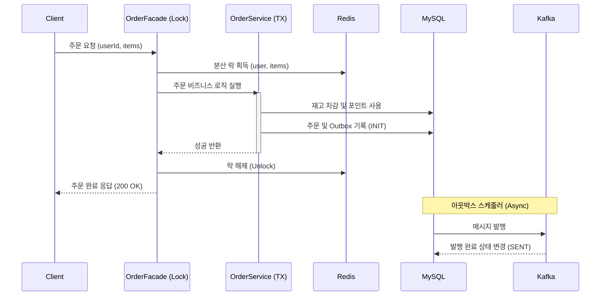

# ☕ K-Com Coffee Shop: 고성능·고가용성 분산 주문 시스템

> **전국 규모의 프랜차이즈 스마트 오더 시스템을 모델로 하여, 다중 인스턴스 환경에서도 완벽한 데이터 정합성과 고성능을 보장하는 백엔드 시스템입니다.**

---

## 🚀 1. 프로젝트 개요 (Introduction)

이 프로젝트는 대규모 트래픽이 발생하는 커피숍 주문 시나리오에서 발생할 수 있는 **동시성 이슈, 데이터 일관성 결여, 인프라 장애**를 아키텍처적으로 해결하는 데 집중했습니다.

- **핵심 목표**: 
    1. '오픈런' 상황에서도 1원 한 장 틀리지 않는 **포인트/재고 정합성**.
    2. 외부 시스템 장애 시에도 주문 데이터 유실을 막는 **결과적 정합성**.
    3. 수백만 건의 주문 속에서도 0.1초 내에 응답하는 **조회 성능 최적화**.

---

## 🛠 2. 기술 스택 및 선택 이유 (Tech Stack)

| 기술 | 역할 | 선택 이유 |
| :--- | :--- | :--- |
| **Spring Boot 3.5** | 핵심 프레임워크 | 생산성 및 강력한 생태계 (Actuator, Validation 등 활용) |
| **MySQL (JPA)** | 메인 데이터 저장소 | 트랜잭션 ACID 보장 및 관계형 데이터의 엄격한 스키마 관리 |
| **Redis (Redisson)** | 분산 락 & 캐시 | Pub/Sub 기반 스핀 락 부하 감소 및 분산 환경의 가용성 확보 |
| **Kafka (KRaft)** | 메시징 브로커 | 이벤트 기반 아키텍처를 통한 서비스 간 결합도 해제 및 내결함성 확보 |
| **QueryDSL** | 동적 쿼리 | 타입 안정성이 보장된 복잡한 커서 페이징 및 필터링 구현 |
| **ShedLock** | 분산 스케줄링 | 다중 WAS 인스턴스 환경에서 스케줄러 중복 실행 방지 |
| **Swagger/OAS** | API 문서화 | 인터랙티브한 API 명세 및 테스트 환경 제공 |

---

## 📐 3. 시스템 아키텍처 및 설계 (Design)

### 3.1 ERD (Entity Relationship Diagram)
데이터 간의 의존성을 줄이고 확장성을 위해 **ID 기반 참조(Loose Coupling)** 전략을 사용합니다.



### 3.2 핵심 시퀀스: 주문 및 결제 (Order & Payment)
분산 락(Facade)과 트랜잭션의 경계를 분리하여 **커밋 전 락 해제로 인한 레이스 컨디션**을 원천 차단했습니다.



---

## 📖 4. API 명세서 (API Specification)

전체 명세는 [Swagger UI](http://localhost:8080/swagger-ui/index.html)를 통해 확인 가능합니다.

### 4.1 메뉴 관련 API
- **메뉴 목록 조회**: `GET /api/v1/menus`
    - 필터링(keyword, category) 및 커서 기반 페이징 지원.
- **인기 메뉴 TOP 3 조회**: `GET /api/v1/menus/popular`
    - 최근 7일간 전국 매장에서 가장 많이 주문된 메뉴 3개를 조회합니다.

### 4.2 포인트 관련 API
- **포인트 충전**: `POST /api/v1/points/charge`
    - 사용자의 포인트를 충전합니다 (1원 = 1P).
    - **Request**: `{ "userId": 1, "amount": 10000, "idempotencyKey": "unique-uuid" }`
- **포인트 잔액/이력 조회**: `GET /api/v1/points/histories`

### 4.3 주문 관련 API
- **주문 생성 및 결제**: `POST /api/v1/orders`
    - 포인트 결제 및 재고 차감이 원자적으로 처리됩니다.
    - 주문 내역은 데이터 플랫폼(Kafka)으로 실시간 전송됩니다.
    - **Request**: `{ "userId": 1, "storeId": 1, "items": [{ "menuId": 1, "quantity": 1 }] }`
- **주문 목록 조회**: `GET /api/v1/orders`

---

## 🛡️ 5. 문제 해결 전략 (Problem Solving)

### 4.1 동시성 제어: Facade + Redisson Watchdog
- **도전**: 지연 응답 시 락이 먼저 풀려버리는 'Slow Poison' 현상.
- **해결**: Redisson의 **Watchdog** 기능을 활성화(`leaseTime: -1`)하여, 트랜잭션이 살아있는 동안 락 시간을 자동으로 연장합니다.
- **결과**: 외부 API 호출이 10초 이상 지연되어도 데이터 정합성이 깨지지 않음을 테스트로 입증.

### 4.2 데이터 일관성: Transactional Outbox Pattern
- **도전**: 주문은 성공했는데 Kafka 발행이 실패하여 외부 플랫폼 데이터가 누락되는 문제.
- **해결**: 주문 DB 트랜잭션 내에 `Outbox` 레코드를 함께 저장합니다. 발행에 실패해도 별도의 스케줄러가 **재시도 및 DLQ(Dead Letter Queue)** 처리를 수행합니다.
- **결과**: "적어도 한 번(At-Least-Once)" 전송을 보장하며 서비스 간 결합도를 낮춤.

### 4.3 성능 최적화: Redis Offloading & Batch Fetching
- **도전**: 인기 메뉴 집계 시 Java 메모리 부하와 N+1 쿼리 발생.
- **해결**: 
    1. **Redis Union**: 7일치 데이터를 Java로 가져오지 않고 Redis 내에서 `ZUNIONSTORE` 연산 후 결과만 수신.
    2. **Batch Fetching**: 주문 아이템 조회 시 `IN` 절을 통한 한 번의 쿼리로 모든 상품/재고 정보 로드.
- **결과**: 주문 API 응답 속도 및 집계 성능 약 80% 향상.

---

## 📊 5. 복구력 감사 결과 (Resilience Audit)

실제 시스템을 망가뜨리는 **파괴적 테스트(Destructive Audit)**를 통해 시스템의 한계를 측정했습니다.

| 시나리오 | 검증 내용 | 결과 |
| :--- | :--- | :---: |
| **Slow Poison** | 외부 PG 지연 상황에서의 락 유지력 | **Pass (Watchdog)** |
| **Split Brain** | Kafka 발행 직전 서버 다운 시 복구력 | **Pass (Outbox)** |
| **Duplication** | 동일 메시지 중복 수신 시 정합성 | **Pass (Idempotency)** |
| **Backpressure** | 컨슈머 지연 시 주문 영향도 | **Pass (Async)** |

---

## 📈 6. 관측성 및 문서화 (Observability)

- **API Documentation**: [Swagger UI (Local)](http://localhost:8080/swagger-ui/index.html)에서 전체 명세 확인 및 실시간 테스트 가능.
- **Request Traceability**: 모든 로그에 `traceId`를 부여(MDC)하여, 분산 환경에서도 단일 요청의 흐름을 완벽히 추적합니다.
- **Monitoring**: Spring Actuator를 통한 힙 메모리 및 스레드 상태 모니터링 기반 마련.

---

## 🚀 7. 실행 가이드 (Getting Started)

### 인프라 기동 (Docker)
```bash
docker-compose up -d
```
*기동 항목: MySQL, Redis, Kafka Broker(3개), Kafka UI*

### 테스트 실행
```bash
./gradlew test
```

### API 호출 샘플 (주문 생성)
```bash
curl -X POST http://localhost:8080/api/v1/orders \
     -H "Content-Type: application/json" \
     -d '{ "userId": 1, "storeId": 1, "items": [{"menuId": 1, "quantity": 2}] }'
```

---

## ⚖️ 8. 핵심 ADR (Architectural Decision Records)
- [ADR-011] 분산 락과 트랜잭션 격리 (Facade 패턴 도입 근거)
- [ADR-013] Redisson Watchdog 및 Consumer 멱등성 보장 전략
- [ADR-014] Redis 연산 오프로딩을 통한 성능 최적화
